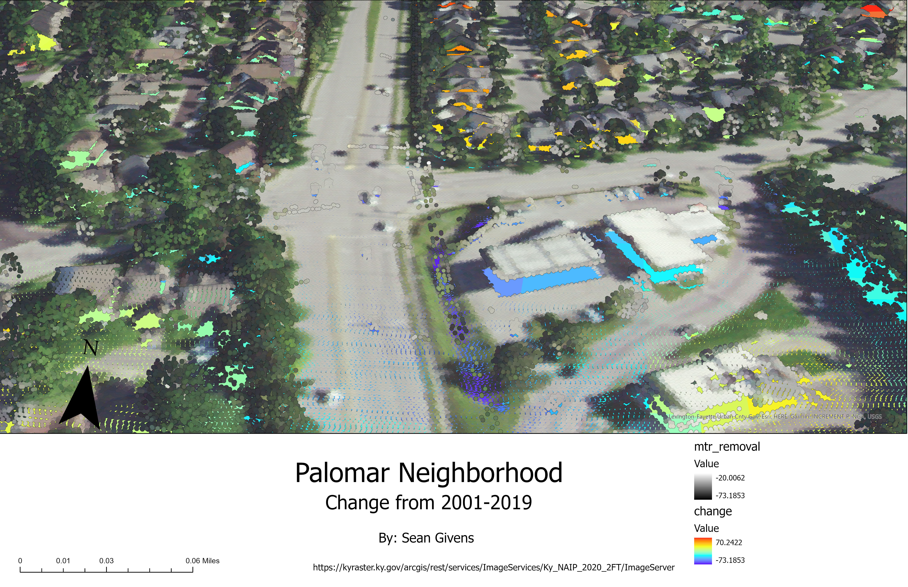

# smgi238-mod-06
change in the neighborhood
Ok, you have practiced three methods to visualize change. Let's turn to the lab where you will use one of the methods for your own project.
# Palomar Neighborhood
## Change from 2010 to 2020

The neighborhood has experienced significant change. The large area that was once just land has several new houses that have been built. There also has been some trees removed in the process

*Caption of Map*

[Download pdf](mod6Layout.pdf)     

